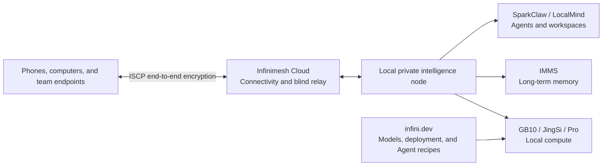

# Infinimesh.ai

> **Intelligence that belongs to you, always under your control.**

[Official Website](https://www.infinimesh.cn/) · [Explore Local AI](https://infini.dev/) · [Open-Source Projects](#open-source-projects)

---

## About Infinimesh

Infinimesh, operated by Hangzhou Huiyunxu Technology Co., Ltd., is an AI systems and intelligent hardware startup based in Hangzhou, China.

We believe the next decade of personal computing belongs to **private intelligence**: AI that runs within boundaries you control, develops a durable understanding of personal or organizational context, acts through explicit authorization, and remains inspectable and auditable.

We are building a local-first AI system that brings together **local compute, long-term memory, bounded agent execution, and trusted connectivity**. Our goal is to turn AI from a one-off model call into a reliable system that can operate continuously, accumulate knowledge, and improve over time.

## Our Mission

Most AI services today run in someone else's cloud. Personal files, organizational knowledge, model interactions, and long-term context often have to leave the devices and environments where they originated.

Infinimesh is designed to reverse that relationship:

- **Keep data within your boundaries.** Personal information, company documents, and model interactions are processed locally by default.
- **Put models and tools under your control.** Users choose how models, data sources, tools, and workflows are assembled.
- **Build intelligence that grows over time.** AI should retain useful context, preferences, and knowledge instead of starting over with every task.
- **Make execution bounded and traceable.** Consequential actions require approval, while important runs leave inspectable traces, artifacts, and results.
- **Use the cloud for connection, not data ownership.** End-to-end encrypted connectivity should not make the cloud the default home of plaintext data or durable context.

## The Private Intelligence Stack

| Layer | What it provides | Products and projects |
| --- | --- | --- |
| **Local Compute** | Persistent compute for local inference, agents, and team workflows | Infinimesh GB10, JingSi GB10, Infinimesh Pro |
| **Long-Term Memory** | Local organization of conversations, files, timelines, preferences, and interactions | IMMS, JingSi |
| **Agents and Workspaces** | Bounded, approval-aware, auditable task execution and collaboration | [SparkClaw](https://github.com/Infinimesh-ai/SparkClaw), [LocalMind](https://github.com/Infinimesh-ai/LocalMind), SparkClaw Work |
| **Trusted Connectivity** | Secure access to private AI across devices while preserving identity, authorization, encryption, and audit boundaries | Infinimesh Cloud, [ISCP](https://github.com/Infinimesh-ai/ISCP) |
| **Developer Ecosystem** | Device-aware model discovery, deployment guidance, and Agent recipes | [infini.dev](https://infini.dev/) |

## Products and Ecosystem

### Infinimesh GB10

A desktop-class local AI system for individuals, developers, AI creators, and small-team proofs of concept. Built around NVIDIA GB10 products, it combines local compute with an Infinimesh-managed software environment so users can deploy models, validate practical use cases, and operate always-available AI services on their own hardware.

### JingSi GB10

An advanced personal AI system powered by IMMS, the Infinimesh Memory System. IMMS organizes conversations, files, timelines, preferences, and interaction history locally so AI can develop a more continuous understanding instead of treating every task as an isolated request. JingSi GB10 is currently evolving through an early co-creation program shaped by real user feedback.

### Infinimesh Pro

A private intelligence collaboration node for teams and departments. It keeps AI workloads, documents, knowledge bases, model calls, and backups within the organization's own environment. SparkClaw Work adds AI-assisted documents, durable knowledge, and auditable team workflows.

### Infinimesh Cloud

The trusted connectivity layer for private intelligence. Built on the open-source ISCP protocol, it connects phones, computers, and local AI nodes through device identity, explicit trust authorization, blind relay delivery, and end-to-end encrypted sessions. The cloud can deliver encrypted messages without becoming able to read them.

### infini.dev

A unified entry point into the local AI ecosystem. Starting with a real device and task, infini.dev helps users choose suitable models, quantizations, runtimes, deployment methods, and Agent recipes. It is designed to make the path from model discovery to a successful, reproducible local run shorter and clearer.

## Open-Source Projects

| Project | Role | Core capabilities |
| --- | --- | --- |
| **[SparkClaw](https://github.com/Infinimesh-ai/SparkClaw)** | Reliable local Agent Runtime for AI workstations | Local model routing, deterministic workflows, schema-validated tools, approval policies, memory, traces, artifacts, evaluations, and a WebChat workbench; currently optimized around NVIDIA GB10 / DGX Spark |
| **[LocalMind](https://github.com/Infinimesh-ai/LocalMind)** | AFFiNE-based, local-first AI workspace | Documents and canvases, durable AI runtime state, approval-gated task execution, worker queues, audit history, support artifacts, and operator-facing controls |
| **[ISCP](https://github.com/Infinimesh-ai/ISCP)** | Interoperable Secure Connectivity Protocol | Device identity, trust authorization and revocation, blind relay delivery, end-to-end encrypted sessions, protocol specifications, Go SDKs, reference services, CLI workflows, and conformance tests |
| **[infini.dev](https://github.com/Infinimesh-ai/infini.dev)** | Local AI discovery and deployment entry point | Model catalog, hardware fit, quantization and runtime guidance, Agent task recipes, deployment guides, and reproducible local setup paths |

## Design Principles

- **Local-first** — models, data, and durable context stay local by default.
- **Private by design** — privacy is an architectural starting point, not an add-on.
- **Bounded execution** — agents operate through explicit tools, permissions, and workspace boundaries.
- **Approval before risk** — consequential changes, deletion, execution, and outbound actions require clear authorization.
- **Auditable by default** — meaningful work leaves inspectable events, traces, artifacts, and results.
- **Open and interoperable** — foundational infrastructure should be reviewable, implementable, and free from unnecessary vendor lock-in.
- **Built for long-term use** — durable understanding matters more than a one-time demonstration.

## Who We Build For

- Individuals who want to run and control AI on their own devices
- Developers who need local models, Agent Runtimes, and reproducible environments
- AI creators who care about the privacy of their source material, knowledge, and creative process
- Small teams validating AI use cases against real workloads
- Organizations protecting documents, knowledge bases, customer data, and process assets
- Open-source contributors working on private AI, trusted connectivity, and agent infrastructure

## Get Involved

- Visit [infinimesh.cn](https://www.infinimesh.cn/) for our products, ecosystem, and latest updates.
- Explore [infini.dev](https://infini.dev/) to find a local AI setup for your device and workload.
- Browse our public repositories, open issues, propose ideas, or contribute pull requests.
- Try early releases and share evidence from real workloads, edge cases, and deployment environments.

---

**Infinimesh.ai — Your intelligence. Your control.**
