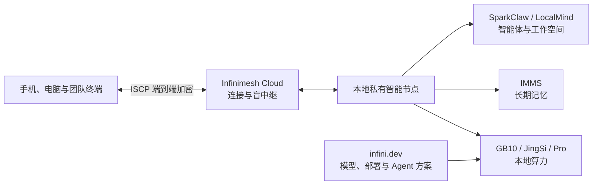

# Infinimesh.ai

> **智能为我，自在掌控。** 
> **Intelligence that belongs to you, under your control.**

[中文](#中文) · [English](#english) · [官方网站](https://www.infinimesh.cn/) · [本地 AI 入口](https://infini.dev/)

---

## 中文

### 关于我们

Infinimesh（杭州汇云旭科技有限公司）是一支来自中国杭州的 AI 系统与智能硬件创业团队。

我们相信，下一个十年的个人计算属于**私有智能**：AI 应该运行在用户自己的边界之内，长期理解个人或组织的知识与偏好，在明确授权下执行任务，并始终保留可控、可查、可审计的使用边界。

因此，我们正在构建一套本地优先的 AI 系统，把**本地算力、长期记忆、智能体执行与可信连接**组织成完整体验，让 AI 从一次性的模型调用，成长为能够持续运行、积累和进化的智能系统。

### 我们的使命

今天，大多数 AI 能力发生在外部云端。个人资料、工作文件、知识沉淀与长期上下文往往需要离开自己的设备和组织边界。

Infinimesh 希望把这件事倒过来：

- **数据留在自己的边界内**：个人资料、企业文档和模型交互默认在本地处理。
- **模型和工具由用户掌控**：从模型选择、数据接入到工作流配置，都可以按真实需求组合。
- **智能可以长期生长**：AI 不只完成一次任务，还能持续沉淀记忆、偏好与知识脉络。
- **执行过程有边界、可追溯**：高风险操作先审批，关键过程留下记录、Trace 与可复核结果。
- **云端负责连接，而不是占有数据**：以端到端加密连接本地智能，云端不成为明文数据与长期上下文的默认归属。

### 私有智能技术栈

| 层级 | 我们解决的问题 | 代表产品与项目 |
| --- | --- | --- |
| **本地算力层** | 为本地模型推理、智能体和团队工作流提供持续、稳定的计算能力 | Infinimesh GB10、JingSi GB10、Infinimesh Pro |
| **长期记忆层** | 在本地组织对话、文件、时间线、偏好与交互，让数据形成可持续积累的智能资产 | IMMS（Infinimesh Memory System）、JingSi |
| **智能体与工作空间层** | 把模型能力转化为有边界、可审批、可审计的任务执行与协作流程 | [SparkClaw](https://github.com/Infinimesh-ai/SparkClaw)、[LocalMind](https://github.com/Infinimesh-ai/LocalMind)、SparkClaw Work |
| **可信连接层** | 让不同设备安全触达本地智能，同时保持身份、授权、传输和审计边界 | Infinimesh Cloud、[ISCP](https://github.com/Infinimesh-ai/ISCP) |
| **开发者生态层** | 帮助用户根据设备与任务选择模型、量化、运行器和 Agent 方案 | [infini.dev](https://infini.dev/) |

### 产品与生态

#### Infinimesh GB10

面向个人用户、开发者、AI 创作者与小团队 PoC 的桌面级本地 AI 设备。基于 NVIDIA GB10 系列产品构建，由 Infinimesh 提供本地软件环境与持续软件服务，让用户能够在自己的设备上部署模型、验证场景并运行全天候本地智能服务。

#### JingSi GB10

搭载 IMMS 的进阶个人 AI 设备。IMMS 以记忆、时间、偏好与交互四层结构，在本地组织对话、文件和行为轨迹，让 AI 不只完成任务，还能逐渐形成更连续的理解。JingSi GB10 目前以先行共创版推动系统能力与真实使用场景共同演进。

#### Infinimesh Pro

面向团队与部门的企业私有智能协作节点。它将 AI、文档、知识库、模型调用和备份放在企业自己的边界内，并通过 SparkClaw Work 支持协作文档、知识沉淀与可审计的团队工作流。

#### Infinimesh Cloud

私有智能系统的可信连接层。它基于开源的 ISCP 协议连接手机、电脑和本地 AI 节点，通过设备身份、信任授权、盲中继和端到端加密，让用户在移动场景中安全触达自己的本地智能。

#### infini.dev

本地 AI 生态的统一入口。从真实设备和任务出发，帮助用户理解并选择合适的模型、量化版本、运行器、部署方式和 Agent 方案，让“发现模型”到“在本地成功运行”的路径更短、更透明、更可复现。

### 开源项目

| 项目 | 定位 | 核心能力 |
| --- | --- | --- |
| **[SparkClaw](https://github.com/Infinimesh-ai/SparkClaw)** | 面向本地 AI 工作站的可靠 Agent Runtime | 本地模型路由、确定性工作流、工具调用、审批策略、记忆、Trace、Artifact、评测与 WebChat；当前重点适配 NVIDIA GB10 / DGX Spark |
| **[LocalMind](https://github.com/Infinimesh-ai/LocalMind)** | 基于 AFFiNE 的本地优先 AI 工作空间 | 文档与白板、持久化 AI 运行状态、审批式任务执行、队列、审计记录、支持包与面向运维者的管理界面 |
| **[ISCP](https://github.com/Infinimesh-ai/ISCP)** | Interoperable Secure Connectivity Protocol | 设备身份、信任授权、吊销、盲中继、端到端加密会话、协议规范、Go SDK、参考服务、CLI 与一致性测试 |
| **[infini.dev](https://github.com/Infinimesh-ai/infini.dev)** | 本地 AI 发现、选择与上手入口 | 模型目录、设备适配、量化与运行器建议、Agent 任务方案、部署指南和可复现的本地运行路径 |

### 我们坚持的设计原则

- **Local-first**：模型、数据和长期上下文优先留在本地。
- **Private by design**：隐私不是附加功能，而是系统架构的起点。
- **Bounded execution**：智能体在明确的工具、权限和工作空间边界内运行。
- **Approval before risk**：涉及变更、删除、执行或对外发送的高风险动作需要明确授权。
- **Auditable by default**：重要任务保留事件、Trace、Artifact 与审计信息。
- **Open and interoperable**：关键协议和基础设施通过开源接受审查，并避免不必要的厂商锁定。
- **Built for long-term use**：我们追求长期稳定的理解和陪伴，而不是一次性的惊艳演示。

### 适合谁

- 希望在自己的设备上运行和掌控 AI 的个人用户
- 需要本地模型、Agent Runtime 与可复现环境的开发者
- 重视素材、知识和创作隐私的 AI 创作者
- 希望用真实任务低成本验证 AI 场景的小团队
- 需要保护文档、知识库、客户资料和流程资产的企业团队
- 关注私有 AI、可信连接与智能体基础设施的开源贡献者

### 参与共建

- 访问[官方网站](https://www.infinimesh.cn/)，了解产品、生态与最新进展。
- 从 [infini.dev](https://infini.dev/) 开始，找到适合自己设备与任务的本地 AI 方案。
- 浏览我们的公开仓库，通过 Issue 或 Pull Request 提交反馈、方案与贡献。
- 试用早期版本，把真实工作负载、边界条件和验证结果分享给社区。

---

## English

### About Infinimesh

Infinimesh, operated by Hangzhou Huiyunxu Technology Co., Ltd., is an AI systems and intelligent hardware startup based in Hangzhou, China.

We believe the next decade of personal computing belongs to **private intelligence**: AI that runs within boundaries you control, develops a durable understanding of personal or organizational context, executes through explicit authorization, and remains inspectable and auditable.

We are building a local-first AI system that brings together **local compute, long-term memory, bounded agent execution, and trusted connectivity**. Our goal is to turn AI from a one-off model call into a reliable system that can operate, accumulate knowledge, and improve over time.

### What we build

| Layer | Purpose | Products and projects |
| --- | --- | --- |
| **Local compute** | Persistent compute for local inference, agents, and team workflows | Infinimesh GB10, JingSi GB10, Infinimesh Pro |
| **Long-term memory** | Local organization of conversations, files, timelines, preferences, and interactions | IMMS, JingSi |
| **Agents and workspaces** | Bounded, approval-aware, auditable task execution and collaboration | [SparkClaw](https://github.com/Infinimesh-ai/SparkClaw), [LocalMind](https://github.com/Infinimesh-ai/LocalMind), SparkClaw Work |
| **Trusted connectivity** | Secure access to private AI across devices without making the cloud the default owner of plaintext data | Infinimesh Cloud, [ISCP](https://github.com/Infinimesh-ai/ISCP) |
| **Developer ecosystem** | Device-aware model discovery, deployment guidance, and Agent recipes | [infini.dev](https://infini.dev/) |

### Open-source projects

#### [SparkClaw](https://github.com/Infinimesh-ai/SparkClaw)

A reliable local agent runtime for AI workstations. SparkClaw turns local models into bounded and auditable workflows through semantic routing, deterministic workflow dispatch, schema-validated tools, approval gates, memories, traces, artifacts, evaluations, and a WebChat workbench. Its current full local-model path is designed and validated around NVIDIA GB10 / DGX Spark.

#### [LocalMind](https://github.com/Infinimesh-ai/LocalMind)

An AFFiNE-based, local-first workspace for durable and auditable AI operations. LocalMind combines documents and collaborative workspaces with persisted runtime state, approval-gated execution, worker queues, audit history, support artifacts, and operator-facing controls.

#### [ISCP](https://github.com/Infinimesh-ai/ISCP)

The Interoperable Secure Connectivity Protocol: an open foundation for device identity, trust authorization, relay delivery, and end-to-end encrypted sessions. The repository includes the protocol specification, JSON Schemas, Go SDKs, reference Relay and Trust Root services, CLI workflows, deployment baselines, and conformance tests.

#### [infini.dev](https://github.com/Infinimesh-ai/infini.dev)

A unified entry point into the local AI ecosystem. It helps people move from a real device and task to a practical local setup by connecting model discovery, hardware fit, quantization, runtimes, Agent recipes, deployment guidance, and reproducible commands.

### Design principles

- **Local-first** — models, data, and durable context stay local by default.
- **Private by design** — privacy is an architectural starting point, not an add-on.
- **Bounded execution** — agents operate through explicit tools, permissions, and workspace boundaries.
- **Approval before risk** — consequential actions require clear human authorization.
- **Auditable by default** — meaningful work leaves inspectable events, traces, artifacts, and results.
- **Open and interoperable** — foundational infrastructure should be reviewable, implementable, and free from unnecessary vendor lock-in.
- **Built for long-term use** — durable understanding matters more than a one-time demonstration.

### Get involved

- Visit [infinimesh.cn](https://www.infinimesh.cn/) for our products, ecosystem, and latest updates.
- Explore [infini.dev](https://infini.dev/) to find a local AI setup for your device and workload.
- Open issues, propose ideas, or contribute pull requests in our public repositories.
- Try early releases and share evidence from real workloads, edge cases, and deployment environments.

---

**Infinimesh.ai — 智能为我，自在掌控。**
